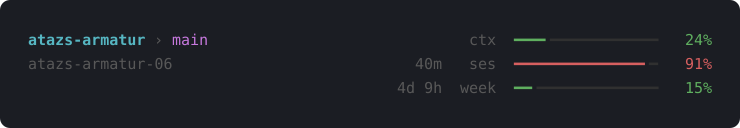

# atazs-armatur

[![CI][ci-badge]][ci]
[![License: GPL-3.0][license-badge]](LICENSE)

A status line for [Claude Code](https://code.claude.com) that shows context usage, the 5-hour
and weekly usage limits with reset countdowns, and the peer name other sessions use to message
this one. One static binary, standard library only, no config file.



I wanted the information I plan my workflow around in view at all times: the folder and branch
to tell sessions apart, context use, and the session and weekly limits with countdowns. The
constraint was not to create any avoidable overhead and preferably to use already provided data.
Lightweight, yet not unpleasant to look at.

[Quick start](#quick-start) · [What it shows](#what-it-shows) · [Install](#install) ·
[What it does and does not do](#what-it-does-and-does-not-do) ·
[Other status lines](#other-status-lines) · [Platforms](#platforms) ·
[Troubleshooting](#troubleshooting) · [Build from source](#build-from-source) ·
[Releases](#releases)

## Quick start

Linux amd64 shown; on a Mac set `f=atazs-armatur-darwin-arm64` (Intel: `darwin-amd64`) and use
`shasum -a 256` instead of `sha256sum`. All platforms are listed under [Install](#install).

```bash
f=atazs-armatur-linux-amd64
curl -fLO https://github.com/ataziran/atazs-armatur/releases/latest/download/$f
curl -fLO https://github.com/ataziran/atazs-armatur/releases/latest/download/SHA256SUMS
sha256sum -c --ignore-missing SHA256SUMS
mkdir -p ~/.local/bin && install -m 755 $f ~/.local/bin/atazs-armatur
```

On Windows, in PowerShell (on ARM, `atazs-armatur-windows-arm64.exe`):

```powershell
$f = "atazs-armatur-windows-amd64.exe"
$u = "https://github.com/ataziran/atazs-armatur/releases/latest/download"
Invoke-WebRequest "$u/$f" -OutFile $f
Invoke-WebRequest "$u/SHA256SUMS" -OutFile SHA256SUMS
$h = (Get-FileHash $f -Algorithm SHA256).Hash.ToLower()
if (-not (Select-String SHA256SUMS -SimpleMatch "$h  $f" -Quiet)) { throw "checksum mismatch" }
New-Item -ItemType Directory -Force "$HOME\.local\bin" | Out-Null
Move-Item -Force $f "$HOME\.local\bin\atazs-armatur.exe"
```

Then merge this into `~/.claude/settings.json`; on Windows append `.exe`
(`~/.local/bin/atazs-armatur.exe`, see [Install](#install)).

```json
{
  "statusLine": {
    "type": "command",
    "command": "~/.local/bin/atazs-armatur",
    "padding": 0,
    "refreshInterval": 60
  }
}
```

> [!NOTE]
> `ses` and `week` need `rate_limits`, which Claude Code sends only to claude.ai Pro and Max
> subscribers, or behind a Claude apps gateway with a spend limit. With an API key both rows
> show `...`.

## What it shows

| Where        | Shows                                               |
| ------------ | --------------------------------------------------- |
| line 1, left | Folder and git branch                               |
| line 2, left | Peer name                                           |
| `ctx`        | Context window used by the current conversation     |
| `ses`        | 5-hour (session) usage limit, with time until reset |
| `week`       | 7-day usage limit, with time until reset            |

- **Peer name.** Tell Claude "ask `project-02` to review this" and it messages that session
  directly. From Claude Code's session registry; empty without an entry.
- **Colour.** Green below 50%, yellow from 50%, red from 80%, on every row.
- **Bars.** 16 cells wide with half-cell resolution. Bars and percentages round down, so 99.6%
  shows as 99% and a bar is only full at 100%.
- **Countdowns.** They read `<1m`, `45m`, `2h41` or `3d 4h`. Once the reset time has passed, the
  row waits for the next value.
- **Unknown values.** The row stays, with a thin track and `...`, never a 0% that is not known.
- **Idle mark.** `◷` before the labels means no new reading for more than 5 minutes. `ses` and
  `week` then draw a thin track behind the unchanged fill, because other sessions and claude.ai
  share those limits and may have used more. `ctx` belongs to this session and keeps its full track.

Idle, with no `week` value yet (`NO_COLOR`, 64 columns):

```text
project › main                  ◷ctx  ━━━━━━╺━━━━━━━━━   38%
project-02                2h41  ◷ses  ━━━━━━━━━━━━╶───   75%
                               ◷week  ────────────────   ...
```

## Install

The [Quick start](#quick-start) is the whole installation. Release assets:

| OS      | amd64                             | arm64                             |
| ------- | --------------------------------- | --------------------------------- |
| Linux   | `atazs-armatur-linux-amd64`       | `atazs-armatur-linux-arm64`       |
| macOS   | `atazs-armatur-darwin-amd64`      | `atazs-armatur-darwin-arm64`      |
| Windows | `atazs-armatur-windows-amd64.exe` | `atazs-armatur-windows-arm64.exe` |

- **Checksum.** A good download prints `<asset>: OK`; the PowerShell block throws on a mismatch.
  For provenance, see [Releases](#releases).
- **Windows.** `~` expands to your home directory. If you write an absolute path, use forward
  slashes: Claude Code runs the command through Git Bash when it is installed, otherwise
  PowerShell, and Git Bash treats unquoted backslashes as escapes, so `C:\Users\...` fails without
  a visible error ([docs](https://code.claude.com/docs/en/statusline#windows-configuration)).
- **macOS.** A browser download carries the quarantine flag and Gatekeeper may refuse to run it;
  `xattr -d com.apple.quarantine ~/.local/bin/atazs-armatur` clears it. `curl` downloads do not
  carry it.
- **With Go 1.27 or later.** `go install github.com/ataziran/atazs-armatur@latest` puts it in
  `$(go env GOPATH)/bin`. Only the release binaries are reproducible and attested.
- **Settings.** `padding: 0` because the lines are already sized to the terminal. `refreshInterval`
  re-runs the command every 60 seconds, so countdowns keep moving while the session is idle.
- **Try it first.** `--version` prints the release and the commit; this renders a sample line,
  with `week` waiting:

  ```bash
  echo '{"context_window":{"used_percentage":38},"rate_limits":{"five_hour":{"used_percentage":75,"resets_at":'$(( $(date +%s) + 9660 ))'}}}' | COLUMNS=80 ~/.local/bin/atazs-armatur
  ```

## What it does and does not do

Claude Code runs the command on every status line update and passes session JSON on stdin. The
binary prints three lines on stdout and exits. Run by hand, it answers `--version` and `--help`.

- **Reads.** `context_window.used_percentage`, `rate_limits`, `transcript_path`, `session_id` and
  the working directory (`workspace.current_dir`, then `cwd`, then its own). Of the transcript it
  reads only the modification time, with one `stat`, never the content. The branch comes from
  `.git/HEAD`, for a linked worktree via its `gitdir:` path, with symlinks in the working
  directory resolved first; a detached HEAD shows as `@<id>`. The session's peer name comes from
  Claude Code's own session registry, `~/.claude/sessions/<pid>.json` (or under
  `$CLAUDE_CONFIG_DIR`), matched on `session_id`. To find the terminal width it may also ask
  `/dev/tty` or, on Linux, the terminal its parent processes hold (`/proc/<pid>/stat` and
  `/proc/<pid>/fd/{2,1,0}`, at most six levels up), read-only.
- **No side effects.** It does not use the network, call an API, read `settings.json`, write to
  disk, spend tokens, or start a subprocess, git included.
- **Untrusted names.** CSI and OSC escape sequences and all C0 and C1 control characters are
  removed from folder, branch and peer names, so a directory named `$'\e[2J'` shows up as text
  instead of clearing your screen.
- **Bad input.** A missing value makes its row wait, out-of-range numbers are clamped, and a field
  of the wrong type (`"used_percentage": "50"`) gives a single empty line. It never prints a stack
  trace.
- **Width.** It comes from `COLUMNS`, which Claude Code sets, then from the terminal, then 80. Four
  columns stay free on the right, because Claude Code cuts every status line a few columns short
  of the edge.
- **Cost.** About 2 ms per call, process start included
  ([measured](docs/how-it-works.md#startup-time)).

Field handling, the width sources per platform, truncation order and the character set are in
[docs/how-it-works.md](docs/how-it-works.md).

## Other status lines

Native status lines also exist in Go
([claudeline](https://github.com/fredrikaverpil/claudeline),
[jftuga/claude-statusline](https://github.com/jftuga/claude-statusline)) and in Rust
([CCometixLine](https://github.com/Haleclipse/CCometixLine),
[AlyIbrahim1/claude-statusline](https://github.com/AlyIbrahim1/claude-statusline)).

The trade-off here is configurability: the layout is fixed. If you want to compose your own line
from segments, themes and widgets, [ccstatusline](https://github.com/sirmalloc/ccstatusline) and
CCometixLine are the better tool.

## Platforms

- **No Nerd Font.** The bars use five characters from the Box Drawing block, which Windows
  Terminal draws itself and Consolas, the conhost default on Windows 10, carries. The branch
  separator is a plain `›`.
- **Idle mark fallback.** On Windows outside Windows Terminal, `◷` is drawn as `○`, because the
  conhost fonts lack it.
- **256 colours.** Meters and frame use 256-colour SGR; folder and branch use your theme's cyan
  and magenta.
- **`NO_COLOR`.** Set to any non-empty value, it removes all escape sequences
  ([no-color.org](https://no-color.org)); the bars still show the level.

## Troubleshooting

- **`ses` or `week` shows `...`.** With an API key Claude Code sends no `rate_limits` (see the
  note under [Quick start](#quick-start)). It also sends them only after the first API
  response in a session, and drops a window once its reset time has passed.
- **`ctx` shows `...`.** Claude Code reports context use only after the first response, so a new
  session, `/clear` and `/compact` wait until the next one.
- **The idle mark appears while Claude is working.** Idle is judged by the modification time of
  the session transcript. A long tool call or a subagent does not write to it, so the mark
  appears during either once more than 5 minutes have passed.
- **The line wraps or is cut off.** Outside Claude Code, export `COLUMNS`. On narrow terminals,
  notifications and the verbose-mode token counter share the row and can still cut into it.
- **Colours look flat or the bar track is invisible.** The terminal, and tmux or screen if you
  use them, needs 256-colour support; the empty part of each bar is a dark grey from that palette.
- **The countdown does not move.** An idle session triggers no updates; set `refreshInterval`.
- **Nothing shows.** Accept the workspace trust dialog for the folder; Claude Code leaves the
  status line blank until then. On Windows, check the forward slashes in `command`.

## Build from source

Go 1.27 (the `go` line in `go.mod`), no dependencies.

```bash
CGO_ENABLED=0 go build -trimpath -ldflags='-s -w' .
go test ./...
```

Checks, golden tests, line endings and the generated width table are described in
[CONTRIBUTING.md](CONTRIBUTING.md).

## Releases

A `v*` tag runs [`release.yml`](.github/workflows/release.yml): tests, six builds from the tagged
commit with the command above, `SHA256SUMS` and a build provenance attestation. To verify a
download, check the checksum as in the [Quick start](#quick-start), then:

```bash
gh attestation verify atazs-armatur-linux-amd64 --repo ataziran/atazs-armatur
```

Builds are reproducible: a clean clone at the tag, built with the same command, Go release and
`GOOS`/`GOARCH`, gives the same bytes ([rebuild example](CONTRIBUTING.md#reproducible-builds)).
Changes per release are in [CHANGELOG.md](CHANGELOG.md).

## Contributing

See [CONTRIBUTING.md](CONTRIBUTING.md). Bugs and questions:
[GitHub Issues](https://github.com/ataziran/atazs-armatur/issues).

## License

GPL-3.0, see [LICENSE](LICENSE).

[ci]: https://github.com/ataziran/atazs-armatur/actions/workflows/ci.yml
[ci-badge]: https://github.com/ataziran/atazs-armatur/actions/workflows/ci.yml/badge.svg
[license-badge]: https://img.shields.io/badge/license-GPL--3.0-blue
